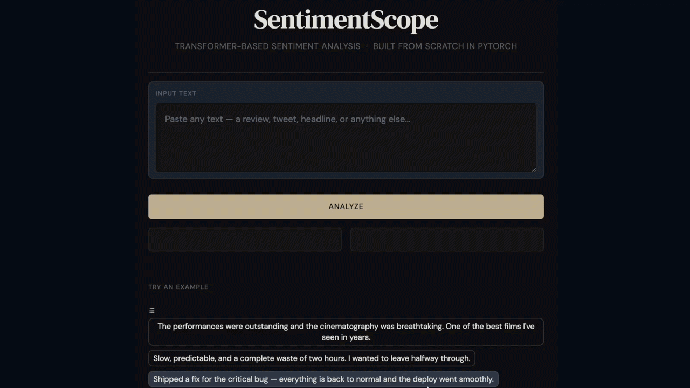
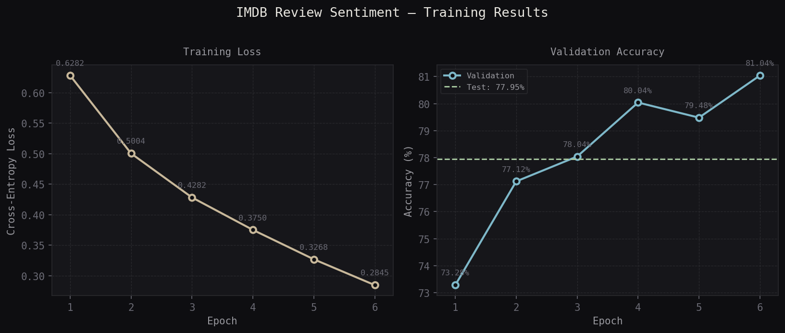

<div align="center">

# SentimentScope

**A transformer built from scratch in PyTorch, trained on 50,000 IMDB reviews, with an interactive demo to try it yourself.**

[](https://www.python.org/)
[](https://pytorch.org/)
[](LICENSE)

</div>

---

## What It Does

SentimentScope is two things at once: a Machine Learning study and a working app.

On the ML side, the entire transformer architecture (attention heads, multi-head attention, feed-forward blocks, positional embeddings, and classification head) is implemented from scratch in PyTorch with no pretrained weights. On the product side, there's a Gradio interface where you can paste any text and get a positive/negative prediction with a confidence score in real time.

Trained on 50,000 IMDB movie reviews, but generalizes to product reviews, headlines, tweets, and most short-form text.

---

## Demo



---

## Architecture

The model is a decoder-style transformer adapted for binary classification:

| Component | Detail |
|---|---|
| Embedding | Token + learned positional embeddings |
| Transformer blocks | 4 stacked blocks with residual connections |
| Attention | 4-head self-attention, head size 32 (d_model = 128) |
| Feed-forward | 2-layer MLP with GELU activation, 4× expansion |
| Pooling | Mean pooling across sequence dimension |
| Classification head | Linear layer → 2 classes |
| Tokenizer | `bert-base-uncased` subword tokenizer (Hugging Face) |

**Training configuration:**

| Hyperparameter | Value |
|---|---|
| Epochs | 6 |
| Batch size | 32 |
| Optimizer | AdamW |
| Learning rate | 3e-4 |
| Max sequence length | 128 tokens |
| Dropout | 0.1 |

**Results:**

| Split | Accuracy |
|---|---|
| Validation | 81.04% |
| Test | 77.95% |



---

## Limitations

Colloquial phrasing, sarcasm, and pop culture references can produce unexpected results. For example, "the last season of Game of Thrones ruined everything" may be misclassified because the strong emotional language pattern-matches to enthusiastic positive reviews. This is a known limitation of training on domain-specific data without fine-tuning.

---

## Project Structure

```
sentimentscope/
├── model.py        # Transformer architecture (AttentionHead, MultiHeadAttention,
│                   #   FeedForward, TransformerBlock, SentimentTransformer)
├── train.py        # Data loading, IMDBDataset, training loop, saves weights + history
├── inference.py    # Loads saved weights, exposes predict()
├── app.py          # Gradio demo UI
├── plot.py         # Generates training curve from saved history.json
├── requirements.txt
└── docs/           # Screenshots and GIFs for README
```

---

## Quickstart

**Prerequisites:** Python 3.10+, pip

```bash
git clone https://github.com/paul-io/SentimentScope.git
cd sentimentscope
pip install -r requirements.txt
```

### 1. Download the dataset

Download the [IMDB dataset](https://ai.stanford.edu/~amaas/data/sentiment/) and extract it so your directory looks like:

```
sentimentscope/
└── aclImdb/
    ├── train/
    │   ├── pos/
    │   └── neg/
    └── test/
        ├── pos/
        └── neg/
```

### 2. Train the model

```bash
python train.py
```

Saves weights to `model/weights.pt`, the tokenizer to `model/tokenizer/`, and training history to `model/history.json`.

### 3. Generate the training curve

```bash
python plot.py
```

### 4. Run the demo

```bash
python app.py
```

Open [http://localhost:7860](http://localhost:7860) in your browser.

### 5. Run inference directly

```python
import torch
from inference import load_model, predict

device = torch.device("cuda" if torch.cuda.is_available() else "cpu")
model, tokenizer = load_model("model", device)

result = predict("The acting was phenomenal and the story kept me hooked.", model, tokenizer, device)
print(result)
# → {'label': 'Positive', 'confidence': 88.4}
```

---

## License

MIT © [Paul](https://github.com/paul-io)